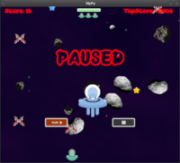
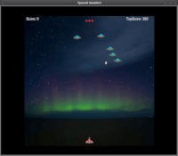

## Welcome to my GitHub Pages

Hello. Thank you for visting my Github pages. You've come to the right place to download some of the Python projects that I've been working on. I would like to hear from you so please, feel free to send me a message to let me know what you think of my projects.
Any feedback is appreciated.

 [GitHub/MyPy_Dodge](https://github.com/corro69/MyPy)  &nbsp; &nbsp; &nbsp; &nbsp; &nbsp; &nbsp;  [GitHub/Spaced_Invaders](https://github.com/corro69/Spaced_invaders)

```markdown
import pygame
pygame.init()

display_width = 800
display_height = 800

white = (255,255,255)
black = (0,0,0,)
red = (255,0,0)
green = (0,255,0)
blue = (0,0,255)

gameDisplay = pygame.display.set_mode((display_width,display_height))
pygame.display.set_caption("Hello World")
icon = pygame.image.load("icon.png")
pygame.display.set_icon(icon)
clock = pygame.time.Clock()
pygame.font.init()

pygame.mixer.music.load("random song.wav")
pygame.mixer.music.play(-1)

class Background(pygame.sprite.Sprite):
    def __init__(self, image_file, location):
        pygame.sprite.Sprite.__init__(self)  #call Sprite initializer
        self.image = pygame.image.load("background.png")
        self.rect = self.image.get_rect()
        self.rect.left, self.rect.top = location
bg = Background('background_image.png', [0,0])

button1 = pygame.image.load("button1.png")
button2 = pygame.image.load("button2.png")

def text_objects(text, font):
    textSurface = font.render(text, True, red)
    return textSurface, textSurface.get_rect()
    
while True:
	largeText = pygame.font.Font('SnackerComic.ttf',115)
        TextSurf, TextRect = text_objects("Hello World", largeText)
        TextRect.center = ((display_width/2),(display_height/3))
	gameDisplay.blit(TextSurf, TextRect)
	
	print("Hello World")
      
main_loop()
pygame.quit()
quit
```
## [MassConceptZ.com](www.maxxconceptz.com)    
## [GitHub](https://github.com/corro69)

### Support or Contact
<dustin.brooks@massconceptz.com>  
<dbrooks@linuxmail.org>
